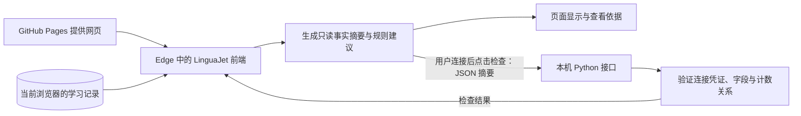

# P-03-A：在线前端连接本机后端——详细设计审核稿

日期：2026-10-02  
状态：R2，待用户审核；本轮仅修改方案和交接卡，不实现产品代码。  
上位规划：[个人学习助手整体路线](2026-10-02-personal-learning-assistant-roadmap-design.md)。  
后续实施：[交接卡](../plans/2026-10-02-p03a-implementation-handoff.md)。

R2 根据本对话最新确认统一重写，取代 R1 的本机前端、记录迁入、导出导入、同源 cookie 会话和独立 local 构建安排。2026-10-02 后续整体规划修订已同步这些运行路线；Obsidian 仍待用户确认追加，尚保留的旧安排不能覆盖本对话的新决定。本稿现已对齐整体规划的技术职责、配置和可见验收说明，未改变下列待审工程参数。管理员身份、后端管理权限与只读管理页面归 P-09-A 上云前准备，不并入本项。具体实现方式仍是待审提案，不表示已经实现。当前审核入口为[实施流程确认卡](../plans/2026-10-02-p03a-execution-approval.md)。

## 1. 已确认的方向与本项成果

| 已确认事项 | 本项遵循方式 |
| --- | --- |
| P-01、P-02 已完成 | 沿用现有学习、复习、更正和保存规则 |
| 日常在 GitHub 在线页面使用 | 保留 https://yang-ss-stack.github.io/cet4-vocabulary-app/ 为日常入口 |
| 不处理旧 localhost 记录同步 | 不核对、迁入、合并或清除旧本机网页记录 |
| 开发验收由在线页面直接连接本机后端 | Python 服务在本机运行，在线前端通过接口请求它 |
| 使用 Microsoft Edge | 首版真实浏览器验收以用户的 Edge 为准 |
| 导出导入不再是刚需则取消 | 从 P-03-A 中删除该工作包及其验收条件 |
| 开发阶段接受一次性连接码 | 连接后请求自动发送摘要；刷新、会话过期或服务重启后重新启动并配对 |
| 先审核方案，再实施 | 本稿认可后才生成实施计划并开始产品实现 |
| 有不确定问题必须询问 | 未核实的事实或需要改变范围、规则的事项逐项询问用户 |

本项完成后，用户可以在原在线页面查看有依据的学习事实与规则建议，启动本机后端并建立连接，点击检查按钮验证真实摘要的请求与返回。断开本机后端后仍可按原方式学习。没有模型调用和模型费用。

P-03-A 建立三项基础：统一事实口径、网页与后端的数据契约、可操作且可核查的后端验收流程。P-03-B 再接模型；P-03-C 再做建议接受、修改、拒绝及生效。完整统计导航和趋势页面留给 P-04-B。

已核对基线：main 提交 `3c54e55dca477cedab51106a29fa04a91c2697ff`，学习数据 v6。它是本轮设计依据；实施开始仍须重新核对，不能覆盖期间新增工作。

## 2. 前端、后端与数据流



学习记录仍存放在用户正在使用的浏览器、原站点的 `linguajet.learning` 中。代码位于 main、推送远程仓库或更新网页，与浏览器个人学习记录不是同一份数据。本阶段不创建学习数据库或第二套学习历史。

前端有权读取本网站在该浏览器中的记录，它主动生成并发送约定摘要；后端收到请求才能使用摘要，不能直接进入浏览器读取 localStorage。不需要用户每次导入文件。P-03-A 使用明确的检查按钮验收；未来 P-03-B 在用户请求建议时通过同一事实模块自动取得最新摘要，发送范围另审，不要求用户手动搬运数据。

网页中的 `127.0.0.1` 指正在打开网页的那台设备。别人打开网页时不会连接到开发者的电脑；未主动开启开发验收且未运行相应服务时，不发起本机请求。未来向其他用户提供服务，需要另外部署可访问的云端后端，并设计账号、权限和每个用户的数据来源。

GitHub Pages 提供静态网页；把 Python 源码推到仓库不会让该后端在 Pages 上运行。[GitHub Pages 官方说明](https://docs.github.com/en/pages/getting-started-with-github-pages/what-is-github-pages)。未来云端部署需要服务运行环境、HTTPS、访问控制与验收，本项不把改一个网址视为已经完成上线。

## 3. 工作范围与读取边界

### 3.1 交付工作包

| 工作包 | 交付内容 |
| --- | --- |
| A1 事实与规则建议 | 今日、近 7 天、完成量、复习负担、真实反馈与更正、证据明细、只读规则建议 |
| A2 本机服务 | Python API、严格摘要契约、一次性配对、临时会话、精确来源限制、限额及启动/停止说明 |
| A3 在线界面联动 | 在线页面的主动连接入口、权限说明、真实摘要检查、非法示例检查、超时与旧响应处理 |
| A4 验收交付 | 自动回归、真实 Edge 在线联调、用户操作清单、运行手册、实际验收报告与学习复盘卡 |

本项不新增导出、导入、数据迁移、同步、账号系统、数据库、聊天、模型、RAG、出题或建议应用。现有损坏数据恢复流程沿用，不为了连接服务重置任何学习记录。

### 3.2 获取一致的只读快照

新增纯函数 `buildLearningFacts(snapshot, context)`；context 含设备本地日期、当前时间、时区、词书资料与当前选定词书。明细与摘要必须从同一投影生成，避免卡片与明细各算一套。

拟在 store 增加只读 `readAssistantSnapshot()`：同步确认持久化原文仍等于该仓库实例保存的基准，返回独立或不可变快照及仅在页面内使用的原文基准。发现另一标签页改动时拒绝陈旧快照并提示重新载入，不自动覆盖或发布新学习状态。该方法须登记到 browserStore 的读取白名单。

事实计算、查看依据、哈希、配对与摘要检查不调用 ensureTodayLearning、ensureTodayReview、反馈或设置保存命令，不补写排程。哈希与网络请求跨越异步边界后，按第 6.3 节重新校验依据。现有学习写入继续使用原站点锁和冲突保护。

## 4. 最小界面与用户操作

### 4.1 今日学习中的事实

沿用现有视觉和学习/复习入口；“计划依据”显示当前词书累计完成、今日固定学习/额外学习/复习进度、当前到期量、任务外积压。任务词书与当前书不同时分别标注。

“已记录反馈”提供今日/近 7 天切换，分别显示自评、选择作答、更正与有效自评，注明历史覆盖限制。折叠“查看依据”按每页 50 条展示任务或事件证据，只在浏览器使用，不上传明细。

复用现有规则建议卡，标注“规则建议”和“计划估算”。缺少资料时写明不能计算的原因；没有接受计划按钮，不改设置、不创建任务、不把不完整事件推断成薄弱点诊断。

### 4.2 开发验收连接区

设置中提供默认关闭、折叠的“开发验收：本机后端”区域。普通访问、学习、切换页和刷新均不自动扫描或连接本机。用户主动展开并选择连接时才显示固定目标、发送范围和权限说明。

操作为：启动服务 → 粘贴一次性连接码 → 点击“连接本机后端” → 在 Edge 提示时允许本地网络访问 → 建立临时连接 → 点击“检查当前学习摘要”。连接码不是学习文件、模型密钥或注册账号；输入框不保存，兑换成功立即清空。

已连接后，摘要自动从最新记录生成，用户不填写进度数字。成功准确显示“连接正常，摘要格式检查通过”，标注本次检查时间；已连接不代表已经检查了当前记录。

另提供“检查非法示例”按钮，仅在已连接的开发验收区出现。它发送固定、明确标为测试数据的非法摘要，预期后端返回 422；结果显示“错误输入已被拒绝”。它不得写学习数据、覆盖事实卡或伪装成真实学习摘要，不增设绕过校验的测试接口。

连接区状态包括未连接、等待权限、正在连接、已连接、检查中、检查通过、依据已变化、连接失败与会话过期。状态文字可被辅助技术读取；键盘、窄屏和减少动态效果均可操作。按钮禁用和进度说明明确，不只用颜色表达。

用户拒绝权限时不发送学习摘要；页面提供该站点权限恢复说明。连接关闭、失败或过期不影响浏览器事实和原学习功能。“断开连接”取消请求并清除页面凭证；再次连接按已确认方式重新启动服务配对。

## 5. 事实口径、对账证据与规则建议

### 5.1 日期、词书、单位

- 今日为设备本地日期；近 7 天包含今日和前 6 个日历日，不按连续 168 小时，也不以服务端时间分组。月底、年底、闰日和夏令时均用日历运算。
- 历史归属沿用 `task.date`，不把 UTC 时间戳截取前 10 位当本地日期。每个任务及事件按其实际词书筛选。
- 累计完成按当前词书唯一词记录计“词”；分期完成按“日期＋词书＋词”计“词次”，每日学习、额外学习、复习分别列示。新词正常不会重复，但不能把复习近 7 天同词多次完成压为一个词。
- 当日学习、复习和额外批次从保存快照独立读取；不存在为 null，存在但分配 0 为 0。`remainingWords = assignedWords - completedWords`，完成包括已经移出任务的完成词，不能因移出而扣除完成量。
- 当前词书负担与今日固定任务可能属于不同词书，必须分栏标注。当前词书累计完成与近 7 天事件只属于 `selectedWordBookId`，不能混入另一词书今日任务。
- 任务内重复 ID 已由原验证器拒绝。若跨任务发现同日新词重复完成，合计仅计一次并显示异常；来源分项保留，来源冲突标记相应指标不可用，不凭空决定归属。

### 5.2 到期与任务负担

当前词书负担直接复用 `reviewLibrary.js` 的 `projectedMissingReviews / dueReviewWords` 纯投影。`getReviewOverview()` 优先采用今日任务词书，不能把其默认结果冒充新选择词书负担。

定义 D 为当前选定词书截至读取时刻到期的唯一词 ID 集合，T 为同词书今日复习固定集合；若今日复习属于另一书则 T 为空：

- `dueCount = |D|`；已正常完成并排到未来的词通常不再在 D 中。
- `outsideTodayTaskCount = |D − T|`，只表示尚未分配到该书今日固定任务的到期词。
- 今日任务剩余由任务进度计算，独立展示，不能把 dueCount 直接标成“今日剩余任务”。
- `needsReconciliation` 表示投影中包含尚未实际保存的旧已完成词排程，页面说明“包含历史补齐估算”，只在原复习创建命令中保存。

到期数不保证等于“任务剩余＋任务外积压”：旧任务、未来日期或可更正完成状态可能使集合不同。Python 只检查 `outsideTodayTaskCount <= dueCount`，不强加不成立的等式。

### 5.3 事件归类与有效反馈

唯一事件标识为 `(taskIdentity, revision)`；固定任务身份为日期与 kind，额外任务使用保存的 taskId，包含词书防止展示混淆。事件明细保留 itemId、时间、source 及更正引用，仅留在浏览器。

| 记录 | 原始计数 | 有效计数 |
| --- | --- | --- |
| 自评认识/模糊/不认识 | 每条真实 self-assessment 计一次 | 同源有效自评；认识被合法更正时转换为模糊 |
| 选择正确/错误/看答案 | 真实 guided-choice 分别计数 | 保留客观选择结果，不转换为自评 |
| 学习或复习更正 | 按引用的原事件分为 fromSelfAssessment/fromChoice | 单独展示，不增加自评总样本数 |
| 默认进度 2、准备选项、揭示详情、下一词、连接、摘要检查 | 均不算反馈 | 均不算反馈 |

对每个日期/词书范围：有效自评总数等于原始自评总数；`effective.known = raw.known − corrections.fromSelfAssessment`，`effective.fuzzy = raw.fuzzy + corrections.fromSelfAssessment`，unknown 不变。选择后的更正不加入 effectiveSelfAssessments。

同标识且内容完全相同的重复事件只计一次，明细提示去重；同标识不同内容、事件顺序矛盾或更正找不到同任务同词正向原事件时，受影响的原始分布及有效分布为 null，并说明“记录存在冲突，无法计算”，不能挑一个结果当真。未受影响的任务完成量及事件分布仍可计算。该投影不修改历史，也不弱化原学习数据验证器。

显示“已记录反馈”，不显示成完整学习次数。当前 v6 未为全部迁移历史保存事件覆盖标记；单看当前版本或空事件数组，无法证明是否完整。因此每期固定携带 `eventCompleteness: not-provable`，并列出 `taskCount / tasksWithoutEvents / legacyTaskCount`。legacyTaskCount 仅统计 method 为 null 的任务；不能用它推算全部曾迁移记录。

零事件显示“已记录 0 次；旧记录可能没有逐次反馈”。没有任何该书任务与词记录时可显示“暂无记录”。累计有进度但零事件不能写成“从未学习”。不认识全局终身计数只作独立事实，不向日期或词书摊派；本项不新增错题分析或能力诊断。

### 5.4 浏览器内对账明细

事实区提供折叠的“查看依据”，复用同一个投影产生的证据：完成指标列出任务日期、类型、词书、完成词；事件指标列出原事件与更正引用。今日/近 7 天可切换，逐次加载或分页（每页 50 条），不能为显示而创建任务。逐项总数应与卡片一致。

证据列表只在浏览器使用，不并入发送摘要或服务日志。它是最小验收能力，独立趋势图、30 天筛选、错题管理及完整统计页仍留给 P-04。

### 5.5 规则建议与边界值

所有可计算建议复用 `daysUntilExam / completedWordCount / buildLearningRecommendation / estimateDailyStudyMinutes`，不新增后端算法，不自动应用：

| 指标 | 定义与不可用情况 |
| --- | --- |
| 剩余新词 | max(0, 词书总量 − 累计完成)，词书元数据缺失时不可计算 |
| 考试所需日均 | 剩余新词 ÷ 剩余天数向上取整；只在有效未来考试日期计算 |
| 界面建议日均 | 现有公式限制在 1–100；原始所需超过 100 单独提醒 |
| 估算每日时长 | 当前设置新词 × 60 秒＋设置复习 × 20 秒，向上取整到 5 分钟 |
| 超负荷 | 沿用现有函数：计划分钟大于 0 且估算超过它；不是个人能力诊断 |

60 秒/20 秒是现有产品估算参数，不是实际计时、研究定律或学习效果保证。此估算是“按当前设置的每日计划”，不包含额外学习，也不声称等于当日固定任务剩余耗时。

考试日期为空时 daysRemaining/deadlineDailyWords/recommendedDailyWords 为 null，但可继续显示剩余词量；日期为今天或过去时显示“不适用”，不做除零。缺任一数量时 estimatedMinutes/overloaded 为 null；数量齐全但计划时长缺失时只将 overloaded 设为 null。旧记录中的合法 0 值照实显示，不能当成已支持“今天只复习”模式。

剩余词量为 0 时保留既有函数返回，界面显示“当前词书新词已完成”；内部推荐最小值 1 不呈现为继续学习新词的要求。累计完成超出词书元数据总量时保留真实计数、提示资料不一致并将相关推荐设为 null，不把异常静默截断成可信建议。

## 6. 浏览器与后端的摘要契约

### 6.1 请求结构及值域

POST /api/v1/facts/check 只接受以下精确结构。所有可空字段必须显式传 null；拒绝额外字段、NaN、Infinity、浮点计数、字符串计数与冒充整数的布尔值。数量为 0–Number.MAX_SAFE_INTEGER 的整数，UUID 和时间/日期须规范合法。

```text
contractVersion: 1
requestId: UUID
basis:
  localDate: YYYY-MM-DD
  generatedAt: UTC ISO 时间
  timeZone: 设备时区名称或 null
  selectedWordBookId: 非空字符串或 null
  snapshotToken: 64 位小写十六进制
  factsToken: 64 位小写十六进制
settings:
  examDate, todayWordBookId, dailyNewWords, dailyReviewWords,
  dailyStudyMinutes, pronunciation, mistakeStudyWords（沿用七项设置值域）
book:
  id: 字符串或 null；与 selectedWordBookId 一致
  label: 字符串或 null
  totalWords: 非负整数或 null
  completedWords: 非负整数
today:
  learning/review: null 或 {wordBookId, assignedWords, completedWords, remainingWords}
  extraLearning: null 或 {wordBookId, batchCount, assignedWords, completedWords, remainingWords}
reviewLoad:
  wordBookId: 字符串或 null
  dueCount/outsideTodayTaskCount: 非负整数或 null
  needsReconciliation: boolean
history:
  today/last7Days:
    fromDate/toDate: YYYY-MM-DD
    wordBookId: 字符串或 null
    completions: {learningWords, extraLearningWords, reviewWords}（各为整数或 null）
    selfAssessments: null 或 {known, fuzzy, unknown}
    choices: null 或 {correct, incorrect, showAnswer}
    corrections: null 或 {fromSelfAssessment, fromChoice}
    effectiveSelfAssessments: null 或 {known, fuzzy, unknown}
    coverage: {eventCompleteness: 'not-provable', taskCount, tasksWithoutEvents, legacyTaskCount}
    issues: 枚举字符串数组
ruleRecommendation:
  null 或 {source: 'rules', remainingWords, daysRemaining, deadlineDailyWords,
          recommendedDailyWords, exceedsDailyWordLimit, estimatedMinutes, overloaded}
```

history 非空分布内的计数均为非负整数。只有 conflicting-event 或 invalid-correction 影响该分布时才允许相应对象为 null；正常没有事件必须返回零计数对象。`issues` 只允许 `duplicate-event / conflicting-event / invalid-correction / completion-source-conflict / catalog-mismatch`，不允许插入自由文字或具体词拼写。未选择词书时 book 的 id/label/totalWords 为 null、completedWords 为 0，reviewLoad 的书和计数为 null；history 书为 null、计数为 0、任务数为 0，界面显示“请先选择词书”而不是计算全库汇总。

today 固定任务的 wordBookId 可与当前书不同；可空旧任务词书保留 null 并提示无法按书归属。extraLearning 为已有额外过程的汇总；存在 exhausted:true 而无批次时返回 batchCount=0、三项词数为 0，wordBookId 取关联当日学习任务，不能误标成没有过程。batchCount 不包括固定任务。

规则对象字段可空性按 5.5：remainingWords 是整数；daysRemaining 是有符号安全整数或 null；两项日均、estimatedMinutes 是非负整数或 null；exceedsDailyWordLimit/overloaded 是 boolean 或 null，条件不可计算时为 null。设置可空数量沿用既有非负整数规则，不将 1–100 界面范围错误用于拒绝全部合法旧数据。

七项设置精确值域：examDate 为合法 YYYY-MM-DD 或 null；todayWordBookId 为非空字符串或 null；dailyNewWords、dailyReviewWords、dailyStudyMinutes、mistakeStudyWords 为非负安全整数或 null；pronunciation 仅为 en-GB/en-US。计数字段在 JS 聚合时也检查安全整数，溢出时停止发送并提示不能形成合法摘要；已明确允许的不可计算字段仍按契约传 null。

### 6.2 校验关系

Python 严格校验结构、长度与以下关系，不重算浏览器学习排程或考试建议：

- 每个任务完成量不大于分配量，剩余量等于两者之差；extraLearning 的 batchCount=0 时三项词数为 0。
- history.today 两个日期均为 basis.localDate；last7Days.toDate 同样为它，fromDate 为其前 6 个日历日。各分期 wordBookId 等于选定书。
- reviewLoad.wordBookId 等于选定书；计数要么均为 null，要么满足 outsideTodayTaskCount <= dueCount。
- 有效自评非 null 时，原始自评与更正分布必须非 null，并满足 5.3 的替换等式；fromSelfAssessment 不大于 raw.known。受冲突或非法更正影响的分布为 null，必须带对应 issues；有效分布为 null 同样须有相应错误。未受影响的分布保留。分布为 null 不能参与加总或显示为 0。
- 完成量为 null 须带 completion-source-conflict；不存在冲突的零完成量必须为 0。未选书的 book/reviewLoad/history 按 6.1 的空值关系检查；book.id 与选定书一致。
- tasksWithoutEvents/legacyTaskCount 均不大于 taskCount；不因为 legacyTaskCount=0 就改标事件完整。
- catalog-mismatch 时 ruleRecommendation 必须为 null；推荐非空时 source 必须是 rules。其显示值域合法，不允许以服务输出覆盖浏览器卡片。

本项“校验通过”的准确文案为“连接正常，摘要格式检查通过”。服务看不到原事件，不能声称“学习记录真实无误”。

### 6.3 状态绑定与延迟响应

浏览器先确认持久化原始值与当前仓库一致；不一致时提示重新载入，不能发送陈旧快照。规范化序列化只排序对象键，保留数组顺序和 null；不依赖浏览器与 Python 浮点格式碰巧一致。SHA-256 在浏览器计算，后端只校验和回显 token，不计算全量学习快照。

`factsToken` 对 `{snapshotToken, localDate, timeZone, selectedWordBookId, book, today, reviewLoad, history, ruleRecommendation}` 的规范化结果计算。它不包含 requestId/generatedAt，避免仅过了一秒就无理由失效；到期负担或其他语义值改变则失效。

前端从最新快照重新构造白名单请求，不把含明细的内部对象整体序列化。计算哈希期间和请求结束后重新读取原始值、重算日期及派生事实；requestId、两个 token、契约版本、status 与当前请求全匹配才显示成功。状态变化、换书、跨天、断开连接或第二次请求均取消旧请求；无法取消已返回内容时仍忽略旧结果。

手动重新检查生成新 requestId，不自动无限重试。截止时刻推进导致语义事实变化时，显示“记录或日期已变化，请重新检查”；本地事实卡片按最新记录更新。

### 6.4 成功、错误与发送范围

成功精确返回 `{contractVersion:1, requestId, snapshotToken, factsToken, status:'validated', receivedAt}`。receivedAt 为服务接收的 UTC ISO 时间，仅作诊断；学习日期由浏览器提供的本地日期决定。前端严格核对字段、值域、请求标识和依据，不接受无效或不匹配响应。

后端只能验证摘要结构与约定关系，无法独立证明浏览器学习真实性。前端原记录对账、纯函数测试与证据明细负责验证统计结果；连接码与状态哈希也不能证明用户真的学过。

发送白名单仅为第 6.1 节字段，不含单词全文、具体错题拼写、原始事件、完整任务、全量历史或能力诊断。快照哈希只能作状态标记，不能替代连接凭证。本阶段摘要只在请求处理中使用，不落盘、不写数据库、不进日志、不发到模型或第三方。

错误统一为 `{error:{code,message}}`，message 为可展示中文，不包含输入原文、连接码或会话凭证。框架默认错误可能回显 input，须统一改写。允许来源的成功和错误都保留正确 CORS 头，避免将 401/422 误报成网络失败；禁止来源的响应不授予 CORS 权限。

## 7. 本机服务、连接保护与浏览器权限

### 7.1 运行边界

技术建议采用 Python、FastAPI、Pydantic、Uvicorn，分别提供运行环境、接口、严格输入模型与 HTTP 服务。独立项目环境、锁定经测试的版本，不修改工具自带 Python。具体版本实施时核验，有兼容性问题先报告再决定替换。

拟固定 `http://127.0.0.1:5280`，只监听该环回地址。端口占用直接说明并退出，不杀进程、不换端口、不改为公网监听。后端仅提供 API，不提供前端、词书或音频，也不要求 dist-local。本项不增加独立 local 构建；现有 Pages 构建与基础路径保持。

启动脚本 `scripts/start-local.ps1` 以前台运行、Ctrl+C 停止。第一次准备依赖有明确步骤；以后启动不自动联网安装。单进程、无自动热重载、无多 worker，避免内存凭证失配。绑定成功后展示服务地址、有效期、一次性连接码和停止方式；这一次人工配对输出是凭证展示入口，普通访问/错误日志不得再次记录秘密。

### 7.2 配对与临时会话

启动时使用密码学安全随机源生成 32 字节连接码，以无填充 base64url 编码成 43 字符，仅在本次启动的人工输出中提供。页面 POST 连接码兑换另一个独立的 32 字节随机会话凭证，同样编码；成功兑换后连接码立即消费，不能重放。失败不显示或回显原码。配对请求/返回精确字段见 7.4，expiresAt 为规范 UTC ISO；拒绝额外字段及错误类型。

会话凭证只留当前页面内存。后续请求使用 `Authorization: Bearer ...`，fetch 使用 `credentials: omit`；不使用 cookie、第三方 cookie 依赖、URL 查询参数或 fragment，不写 localStorage、sessionStorage、学习快照或仓库文件。

单次启动只允许一次成功配对、一个有效会话。刷新/关闭页面会丢失凭证，会话过期或服务重启同样不能继续使用；按用户已确认方式停止并重新启动，获取新码再连接。不要为恢复连接增设免认证发码接口。一次配对可用于多次摘要请求，不是每次向助手提问都输入码。

配对请求断连或超时后不能确定码是否已消费，不自动重放；提示重新启动服务获取新码。客户端在连接尝试被取消、刷新或断开后忽略迟到配对返回，不能重新进入已连接状态。

后端访问认证在本项只回答“请求是否持有本次配对凭证”，不证明现实身份，也不是多人账号登录。未来云端上线需要另行设计用户登录、会话、数据归属、授权、滥用与费用限制；不能把本机连接码直接当正式云端认证。

### 7.3 三道独立检查

1. Edge 本地网络权限：用户允许这个在线站点联系本机服务。它不代表允许来源可任意使用 API。
2. 来源与 Host：后端 Host 只允许 `127.0.0.1:5280`；浏览器 API Origin 只允许 `https://yang-ss-stack.github.io`，精确匹配协议与主机，不使用 `*` 或任意反射。
3. 会话凭证与请求结构：业务接口要求有效 Bearer，随后严格校验摘要；伪造 Origin 的非浏览器客户端仍不能凭 Origin 获得访问。

Origin 不含 `/cet4-vocabulary-app/` 路径，同一 GitHub Pages 主机下其他项目可能共享该 Origin；不能宣称 CORS 能隔离这些路径。配对和可信前端均仍必要，本项不承诺防御已被攻陷的同源页面或本机恶意软件。

在线到本机是跨源请求。CORS 预检 OPTIONS 精确检查 Origin、请求方法和请求头，允许 GET/POST 及所需 Content-Type/Authorization；预检不要求 Bearer，否则浏览器无法发送业务请求。实际请求再按接口验证凭证，返回精确 Access-Control-Allow-Origin，并使用 Vary: Origin；不设置允许携带 cookie 的选项。CORS 机制及预检参考 [MDN](https://developer.mozilla.org/en-US/docs/Web/HTTP/Guides/CORS)。

不沿用 R1 的 Sec-Fetch-Site: same-origin 要求。目标 Edge 的在线到环回请求通常为 cross-site；业务请求要求该预期值，缺失/不匹配明确拒绝。测试客户端显式设置合法头不能代替真实 Edge 行为验证；如实测不同先询问，不默默放宽生产检查。

Microsoft 官方文档说明 Edge 143 起加入本地网络访问限制，fetch 联系 localhost 涉及权限；HTTP localhost 有相应混合内容例外。因此不能断言所有 HTTPS 到本机 HTTP 都不可行。[Microsoft Edge 官方说明](https://learn.microsoft.com/zh-cn/deployedge/ms-edge-local-network-access)。

本轮只读核对本机已安装 Edge 154.0.4258.48，未证明实际打开的进程/资料与权限状态。验收记录实际浏览器版本、页面 URL、是否顶层打开及允许/拒绝结果；不使用嵌入 iframe 的预览代替正式页面。权限查询须能力检测并处理不支持，不能把查询失败推断成用户拒绝。

只有用户点击连接才进行首次健康请求并可能触发权限提示。查询已拒绝时显示恢复说明；状态不明时说明将出现提示再请求。首次权限操作拟等待最多 60 秒且可取消，避免按摘要 5 秒超时把用户正在阅读权限框误报成服务故障；其余已授权接口等待上限拟为 5 秒。过期操作的结果忽略，用户可重新点击。浏览器无法暴露详细原因时显示“连接失败，检查服务和站点权限”，不伪称确切原因。

不关闭 Edge 安全机制、不改企业策略/注册表、不开放隧道或公网端口、不自动扫描多个地址。无法按当前方法连接时保留失败证据，询问用户再调整路线。

### 7.4 接口与限额（待审工程参数）

| 接口 | 精确输入/输出 | 检查 |
| --- | --- | --- |
| GET /api/v1/health | `{service:'linguajet-local', contractVersion:1}` | Host、Origin、预期 Fetch-Site；不返回凭证或学习内容 |
| POST /api/v1/session | `{connectionCode}` → `{sessionToken,expiresAt}` | 来源、JSON、单次连接码；仅成功时消费 |
| POST /api/v1/facts/check | 第 6.1 节 → 第 6.4 节 | 来源、有效 Bearer、严格结构和关系 |
| OPTIONS 上述已知 API | 无学习正文 → 204 与所需 CORS 头 | 来源、方法与请求头；不消费连接码，不要求会话 |

普通网页、未知 API、docs/redoc/openapi 均不提供；未知路径返回 JSON 404，不回退到前端 HTML。不增设任意文件读取、命令执行、网络代理或写学习数据的接口。

| 参数 | 提议值 |
| --- | --- |
| 服务地址 | 127.0.0.1:5280 |
| 连接码有效期 | 启动后 5 分钟，单次成功使用 |
| 会话有效期 | 12 小时，不滑动延长；重启失效 |
| 首次权限操作 / 普通接口等待 | 60 秒 / 5 秒；均可取消且忽略迟到响应 |
| 摘要正文 / 配对正文上限 | 256 KiB / 4 KiB，按实际读取流限制 |
| 配对尝试 / 摘要频率 | 每服务每分钟 10 次 / 每会话每分钟 30 次 |
| ID 与 label / timeZone 长度 | 最多 200 / 100 字符；issues 至多 5 个且不得重复 |

以上为本稿待审保护值，不是性能或安全证明。计数限制包括适用失败请求，429 带 Retry-After；重启清除内存会话与限流。读取正文时执行大小限制，不只相信 Content-Length；只接受 application/json，拒绝重复 JSON 字段和非有限数值，未知字段拒绝。

| 失败 | 状态与界面含义 |
| --- | --- |
| JSON 不合法 / 内容类型不支持 | 400 INVALID_JSON / 415 CONTENT_TYPE_UNSUPPORTED |
| 码不合法、过期、已消费 | 401 CONNECTION_CODE_INVALID；提示重新启动配对 |
| 缺会话或过期 | 401 SESSION_REQUIRED / SESSION_EXPIRED；清除旧凭证 |
| Host、Origin、Fetch-Site 不允许 | 403 SOURCE_FORBIDDEN；不授予非法来源 CORS |
| 正文超过上限 | 413 BODY_TOO_LARGE |
| 字段、类型或关系不符 | 422 FACTS_INVALID，不回显输入 |
| 请求太频繁 | 429 RATE_LIMITED，说明等待时间 |
| 路径不存在 / 服务内部失败 | 404 API_NOT_FOUND / 500 INTERNAL_ERROR，中文通用说明 |
| 浏览器权限、断连、超时、响应不符、依据变化 | 前端分别展示已知原因；不改学习数据，不无限重试 |

API 响应使用 Cache-Control: no-store。日志仅包含操作、状态、耗时及合法随机 requestId；不记录正文、Authorization、连接码或个人单词。服务退出仅丢失临时连接状态，在线浏览器记录保留。

### 7.5 配置与模块分工

前端只管理公开连接地址、请求白名单及页面状态；后端集中管理固定监听边界、允许来源、正文和频率限额、配对与会话有效期。参数以本稿第 7.4 节为准，不增加用户可任意填写目标网址的入口，也不通过环境配置开放公网监听或扩大来源。

FastAPI 负责组织接口，Pydantic 提供字段模型，Uvicorn 负责单进程运行；计数关系、重复 JSON 键、正文流大小、凭证失效、限流、统一脱敏错误及日志规则由产品代码明确实现和测试。前端事实模块独立于后端，服务停止不妨碍只读事实和既有手动学习。

本项无模型密钥或数据库配置；P-03-B 才设计供应商私密配置，P-09-A 才设计管理员及管理数据保存方式和位置。依赖安装在项目隔离环境中，实施时核对兼容性并锁定实际验证版本；不升级用户工具环境，有兼容性问题先询问。

## 8. 后端验收与通过条件

### 8.1 三种校验分别负责什么

| 名称 | 回答的问题 | 谁验证 |
| --- | --- | --- |
| 访问认证 | 请求是否有正确的本机连接凭证？ | 后端测试、配对与过期实际操作 |
| 输入校验 | 摘要字段、类型与计数关系是否合规？ | 后端测试、合法摘要及非法示例按钮 |
| 产品验收 | 真实网页联调是否可靠，学习结果是否能对账？ | 自动回归、真实 Edge 联调与用户操作 |

后端不必有独立复杂界面。页面按钮触发接口，返回在页面显示；Codex 另提供实际自动检查结果，使用户同时看到正常输入可用、错误输入被拦截，以及后端异常不会损坏学习记录。

### 8.2 合成对账样本

| 样本 | 预期 |
| --- | --- |
| 新复习初始进度 2，未操作 | 分配 1、完成 0、剩余 1；反馈事件 0 |
| 两次认识后 4→3 更正 | 原始 known=2；有效 known=1/fuzzy=1；自评更正=1；完成回退 0，排程恢复 |
| 选择 correct 后更正 | choice.correct=1、更正选择=1；自评仍 0，不伪造不认识 |
| 固定学习完成 2，额外两批各完成 1 | 学习 2、额外 2、batchCount=2；累计唯一完成 4 |
| 旧记录 3 个完成词、没有事件 | 累计 3、事件 0、完整性不可证明，不补造反馈 |
| 今日任务为书 A，当前书 B | 今日任务 A、当前累计/历史/负担 B，分栏不混合 |
| D={a,b,c,d}、同书 T={a,b} | 到期 4、任务外积压 2；任务剩余独立计 |
| 今日和前 6 天同词复习完成，前第 7 天亦完成 | 近 7 天复习 2 词次，前第 7 天不计 |

夹具通过现有合法模型/命令生成；异常事件投影用独立合成夹具，不写用户存储、不放宽原模型校验。更正样本同时对账完成量、排程及原事件引用。

### 8.3 验收矩阵

| 编号 | 检查 | 必须留下的证据 |
| --- | --- | --- |
| F01 | 第 8.2 节样本、学习/复习两类更正、额外批次 | 原任务/事件到卡片与明细对应 |
| F02 | 重复、冲突、非法引用、旧事件缺失 | 原始/有效分开；不可计算为 null，不冒充 0 |
| F03 | 月末、年末、闰日、夏令时、零记录、异书 | 日历范围、单位、任务与当前书区别正确 |
| F04 | 到期投影与任意未来到期时间 | 集合差正确；不补写、不创建任务 |
| R01 | 考试未来/当日/过去/空，全书完成，旧合法超范围/缺值 | 复用公式、缺值不补 0、只读无应用 |
| S01 | 合法请求、负数、字符串/布尔计数、多字段、矛盾关系、重复键 | 对应结果与状态码，错误不回显内容 |
| S02 | OPTIONS 与实际请求、非法/缺失 Origin/Host/Fetch-Site/Bearer | 合法预检无凭证成功；业务无凭证拒绝；非法来源无 CORS 授权 |
| S03 | 错码、过期、重放、刷新、重启、会话过期、频率上限 | 可解释失败及重新配对，数据不变 |
| S04 | 迟到返回遇反馈/更正/跨日/换书/到期变化/断开/第二请求 | 旧结果不显示为当前成功 |
| S05 | 大小边界、非 JSON、非 JSON 响应、错误 token、内部错误 | 有限等待、统一错误、无无限重试 |
| E01 | 实际 Edge：在线 HTTPS 页面到本机 API | 版本/URL/头与 CORS/权限结果；合法摘要成功与非法示例 422 |
| E02 | 拒绝/允许/恢复本地网络权限；服务停止和端口占用 | 拒绝不发学习摘要；恢复可连接；停止后学习可继续；不换地址 |
| U01 | 默认关闭、事实明细、连接码清空、刷新丢会话、状态说明 | 1280×800 与 360×640、键盘与减少动态效果 |
| G01 | 原学习/复习/额外/更正/音频完整回归与 Pages 资源 | 实际前端/后端测试、lint、构建及浏览器证据 |
| G02 | 网络白名单、日志、只读存储、无模型 | 无原文上传、无凭证持久化、摘要期间无 setItem，无第三方摘要请求 |
| E03 | 真实用户在线记录对账和关闭后端继续学习 | 用户核对当前真实进度，原站点与学习记录保留 |

先完成新增聚焦检查，再执行全量前端测试、lint、Pages 构建与后端测试。预计命令：`npm test -- --maxWorkers=2`、`npm run lint`、`npm run build -- --base=/cet4-vocabulary-app/`、隔离环境的 `python -m pytest backend/tests`。不增加 build:local。测试数量和通过状态只填实际结果，本轮只改文档，不宣称产品验证通过。

本地组件或测试客户端通过不能替代 E01/E02。当前部署流程 push main 会更新在线页面：真实在线验收需要新版本发布。先完成可审查实现和本地自动验证，再单独确认发布授权；方案审核不自动授权 push main。未获发布授权或在线验收未完成时，明确记“代码验证完成，真实在线联调待完成”，不得宣布整项验收通过。

阻断条件：学习记录损坏或被覆盖、读取产生写入、原规则回归失败、默认进度伪造事件、来源/凭证保护失效、超范围上传、旧返回冒充当前结果、未经授权发布。真实记录不作破坏性演示，拒绝与边界测试使用合成数据或隔离资料。

### 8.4 用户可操作的验收清单

1. 仍在原 GitHub 页面查看已保存进度，核对“计划依据”和“查看依据”，记录当前设置及任务情况。
2. 按运行手册启动本机服务，粘贴连接码，点击连接，允许 Edge 本地网络访问，看到“已连接”。
3. 点击“检查当前学习摘要”，看到“连接正常，摘要格式检查通过”；检查时间更新，学习设置与任务进度不变。
4. 点击“检查非法示例”，看到“错误输入已被拒绝”，事实卡和真实记录不变。
5. 在独立测试资料中执行一次正常反馈或更正，再检查，确认事实随记录更新且旧结果不冒充最新结果。用户真实学习只按其正常意图操作。
6. 刷新网页，学习记录仍在，开发连接丢失；重启服务并用新码重新连接。旧码/旧会话拒绝另由自动检查和隔离资料证明。
7. 停止本机服务，检查按钮显示失败；原学习/复习按钮仍可正常使用，刷新后记录仍保留。
8. 在隔离资料中拒绝权限，确认不会发送学习摘要；重新允许后可按流程连接。核对 Codex 提供的测试与联调报告。

用户不需要先编写完整后端或从开发者工具搬出个人记录。验收报告区分自动检查、Codex 实际浏览器检查、用户验收和未完成事项。

## 9. 实施边界、文件与顺序

| 位置 | 预计职责 |
| --- | --- |
| src/data/assistant/facts.js、对应测试 | 纯事实投影与浏览器明细 |
| src/data/assistant/snapshotToken.js、对应测试 | 规范序列化、状态与语义哈希 |
| src/data/assistant/localClient.js、对应测试 | 明确连接、权限状态、配对、Bearer、超时与迟到返回 |
| src/data/learning/store.js、browserStore.js、对应测试 | 一致性只读快照，不新增导入写命令 |
| LearningFactsPanel、LocalBackendCheckPanel 及相关样式/测试 | 事实与折叠开发验收区 |
| TodayLearningPage、SettingsPage、必要 App 上下文及相关测试 | 沿用概览/建议，接入只读事实和开发连接 |
| backend/pyproject.toml、requirements.lock | 隔离 Python 环境与验证后的版本 |
| backend/linguajet_local/app.py、contracts.py、session.py、__main__.py | API、契约、来源/配对/会话/限流、启动 |
| backend/tests/ | 输入、认证、来源、预检、限额、生命周期与错误 |
| scripts/start-local.ps1、.gitignore | 前台启动及忽略虚拟环境/缓存，不改 Pages 构建路径 |
| docs/p03a-local-foundation.md、docs/p03a-acceptance.md | 用户运行/验收说明及实际证据 |

批准后：读取最新基线与批准证据 → 编写可执行计划 → 在合适隔离工作区实施 A1 → A2 → A3 → A4。先核对已有工作区，不把主目录旧 P-02 草稿或未相关规划纳入任务提交。不强制修改 package.json/vite 配置，只有实际依赖或验证需要才列入计划并解释。

各阶段完成必要验证后再推进。实际在线联调以单独获准发布为前置；这不是要求用户批准未经验证的产品。不得恢复 R1 的迁移、cookie 同源限制或仅本地构建开关，否则会违背已选在线联调路线。

现有学习完成 3 次、复习初始 2/完成 4、更正撤回、固定任务、间隔排程、跨日和积压沿用 P-01/P-02。原 getDailyStats 保留兼容，不能将其累计进度冒充反馈次数。音频、学习引擎和设置滚轮不做无关重构。

## 10. 本次审核与后续交接

本次请审核：A1–A4 范围；第 5–6 节事实及摘要口径；第 7 节配对、来源与参数；第 8 节后端验收。已确认连接路线、浏览器、取消导出导入与开发配对方式；具体参数和完整方案仍需本次审核。

本轮不创建实现分支、不安装依赖、不写产品代码、不提交或推送、不发布、不更新 Obsidian 或独立学习项目。方案批准后再编写实施计划。交接卡是恢复材料，不是批准证明。

完成 P-03-A 后提供运行手册、实际验收记录与学习复盘卡。最小复盘是理解“浏览器记录 → 网页生成摘要 → 后端认证/输入校验 → 页面显示”，运行合法与非法请求并指出哪里没有写学习记录；独立学习项目的 L 编号和进度在该项目核对。

P-03-B 的模型供应商、密钥、费用、发送范围与输出契约另审；P-03-C 的采纳和生效另审。教学资料检索、按薄弱点出题及考试约束属于后续产品设计，本项只建立可复用事实接口，不声称已有 RAG 或教师能力。

如需同步长期记忆，先向用户展示拟追加内容和位置，得到确认后才写入；取消导出导入及变更联调路线的决定尚未写入 Obsidian。本稿保留上述明确冲突提示，防止后续实施按旧安排恢复迁移。

### 10.1 核对依据与设计自检

已核对 Obsidian 记忆索引、偏好、工作流、项目状态、整体规划、Agent 学习/产品分工；代码依据为学习 model/store/browserStore/reviewLibrary/recommendations、页面恢复与概览、部署配置。基线和已安装 Edge 版本为本轮只读检查结果，不代替实施时重新核对。

R2 自检要求：全文不再安排导出导入或真实迁移；不再要求本地前端构建；普通在线访问不请求环回服务；正确允许在线跨源预检；认证与摘要哈希分开；已连接与已检查分开；真实在线联调与发布授权分开；模型零调用。

### 10.2 主要技术资料（2026-10-02 核对）

- [GitHub Pages：静态网站托管](https://docs.github.com/en/pages/getting-started-with-github-pages/what-is-github-pages)。
- [Microsoft Edge：本地网络访问、权限与 localhost](https://learn.microsoft.com/zh-cn/deployedge/ms-edge-local-network-access)。
- [MDN：CORS 与预检](https://developer.mozilla.org/en-US/docs/Web/HTTP/Guides/CORS)。
- [FastAPI：接口测试](https://fastapi.tiangolo.com/tutorial/testing/)。
- [Pydantic：严格模式](https://docs.pydantic.dev/latest/concepts/strict_mode/)，额外字段、重复键和算术关系仍需显式处理。
